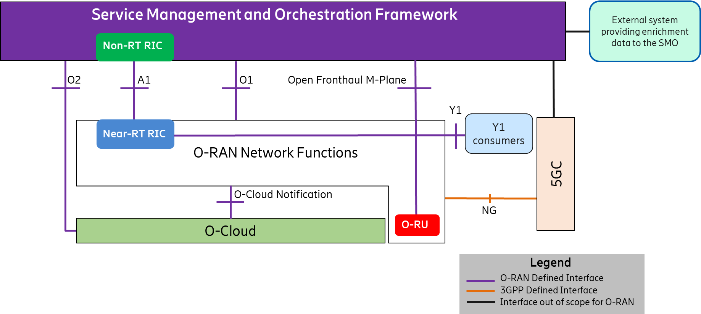
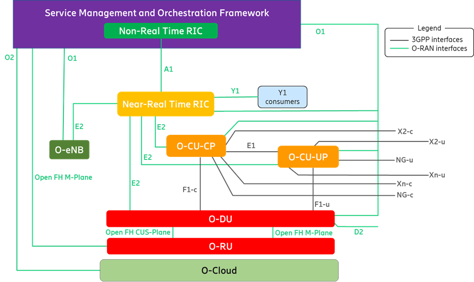
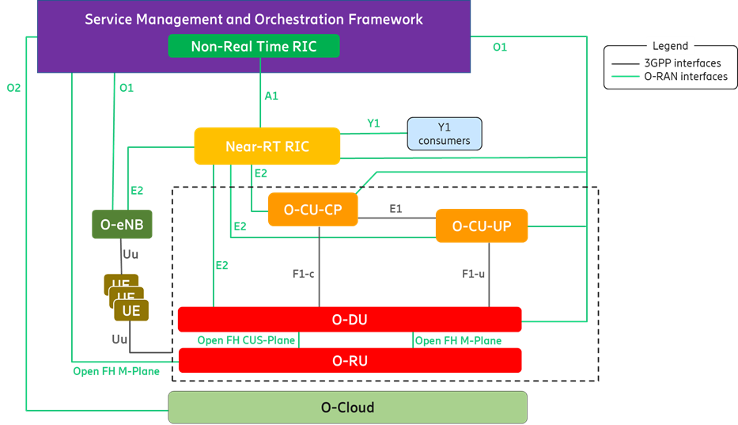
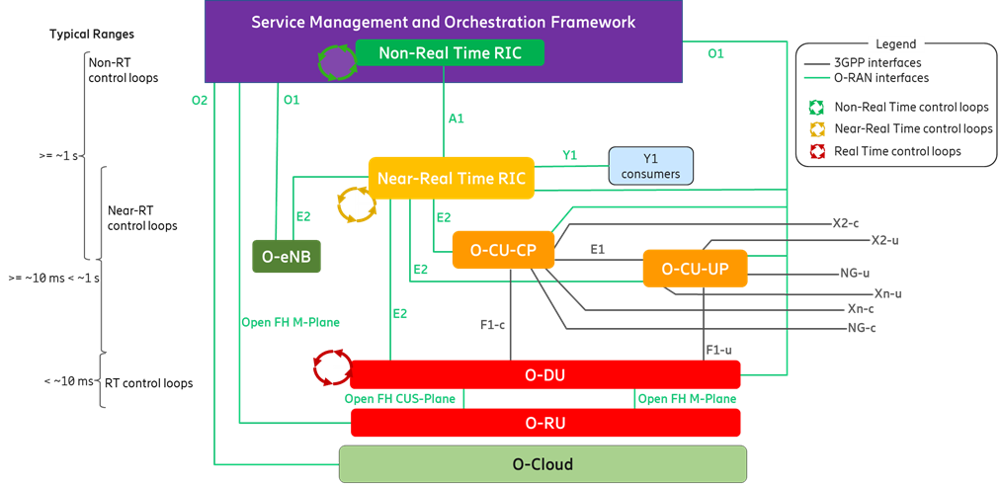

# Arquitetura O-RAN

A arquitetura pode ser apresentada em diferentes escopos

## Arquitetura em Alto Nível

Nessa perspectiva, temos 4 grandes entidades,
- O sistema de gerenciamento e orquestração,
onde se encontra o Non-RT RIC;
- As funções de rede da RAN,
onde se encontra o Near-RT RIC;
- A parte de processamento em núvem;
- e o Núcleo da rede;

Entre essas entidades temos as interfaces:

- A1
- O1
- Open Fronthaul M-plane
- e A2

Conectando o Frameworkd de SMO (Service Management and Orchestration)
com as funções de rede (O-RAN Network Functions)
e os recursos em núvem (O-Cloud).

Como mostrado na Figura, o O-Cloud tem uma interface de notificação
para as funções de rede O-RAN

Vamos detalhar um pouco mais algumas das interfaces:

- **O1:** 
  - Gerencia todas as Funções de Rede (NFs) da O-RAN, exceto O-RU, para um framework SMO autorizado;
  - Permite o gerenciamento de NFs individualmente ou em conjunto;
- **Open Fronthaul M-plane:**
  - Conecta SMO e O-RU (O-RAN Radio Unit)
  - Promove suporte no gerenciamento em modo híbrido do O-RU (feita pelas interfaces O1 e o Open Fronthaul);

Podemos destacar também que as funções de rede O-RAN podem ser hospedadas
em um hardware customizado ou na O-Cloud;

As funções de rede (NFs) instânciadas no O-Cloud podem utilizar APIs apresentadas por AAL (Accelerator Abstraction Layer);

---
**OBS: O que é um Accelerator Abstraction Layer (AAL)?**
- É uma camada de abstração que fornece APIs padronizadas para acessar aceleradores de hardware (ex.: GPU, FPGA, SmartNICs, DPU).
- Evita que cada NF tenha que depender de drivers específicos de fornecedores.
- Garante portabilidade dos NFs em diferentes infraestruturas O-Cloud.
---

O Near-RT RIC (Near-Real-Time RAN Intelligent Controller) O-RAN NF fornece serviços de análise da RAN através da interface Y1.
Esses serviços podem ser consumidos por Y1 Consumers.

---

**OBS:** Exemplos de Y1 Consumers são: módulos de análise de tráfego da operadora ou sistemas de planejamento de capacidade,

---

## Arquitetura em Nível Lógico

Como mostrado na Figura acima, 

Algumas das partes apresentadas nesse nível são

- Near-RT RIC → Controlador inteligente quase em tempo real (10 ms – 1 s).
- O-CU-CP (Centralized Unit – Control Plane) → Gerencia controle de sinalização, RRC, parte do PDCP.
- O-CU-UP (Centralized Unit – User Plane) → Trata o tráfego de dados do usuário, PDCP, encaminhamento de pacotes.
- O-DU (Distributed Unit) → Processa as camadas RLC, MAC e parte do PHY.
- O-RU (Radio Unit) → Lida com a parte de RF e camada física mais próxima da antena.
- eNB (eNodeB) → Agrega as funções de estação radio base do LTE/4G.  
- O-Cloud → Plataforma de computação em nuvem que podem hospedar as NFs relevantes do O-RAN (como Near-RT RIC, O-CU-CP, O-CU-UP e O-DU, etc.). 

O Near-RT RIC se conecta com a gNB (CU e DU) e eNB através da interface E2, e também 
presta serviço aos Y1 Consumers pela interface Y1;

O O-RU fornece a interface Open Fronthaul M-Plane ao O-DU autorizado em modo hierárquico, ou ao O-DU e SMO autorizados em modo híbrido

O-DU fornece a interface D2 para se conectar com O-DUs pares para suportar a agregação de portadora inter O-DU. A interface D2 inclui serviços D2-u e D2-c.

### Interface das UEs

Dentro dessa estrutura os UEs podem se conectar a RAN por meio da interface Uu.
Essa interface é disponível tanto a eNB quanto a gNB.

## Loops de Controle

A arquitetura O-RAN suporta pelomenos 3 loops de controle envolvendo
suas entidades. São eles:

- Non-RT control loops (tempo >= 1s);
- Near-RT control loops (tempo >= 10ms);
- RT control loops (tempo < 10ms);

Os loops existem em vários níveis e rodam simultaneamente. 
Dependendo do caso de uso eles podem ou não interagir entre si.

Existem os casos de usos que tratam das interações entre os RICs 
e também as interações entre o O-CU-CP e os loops de controle do O-DU 
(responsáveis por, por exemplo: controle de chamadas e mobilidade, HARQ, formatação de feixe...)

Os loops de controle ocorrem em uma faixa de tempo esperada

A O-RAN TS: "Use Cases Detailed Specification" define como que acontecem essas interações
entre os RICs e loops de controle;

---

**OBS:** O que são os RICs?

RIC (RAN Intelligent Controller) é um controlador que utiliza de 
IA/ML, algoritmos de otimização, políticas ou outras estratégias para
atuar sobre a rede através das interfaces disponíveis.

---

### Dúvidas

- Onde fica localizado o SMO?
- Quando falando de funções de rede, estamos falando de que exatamente?
- O que fazem essas interfaces serem a mesma interface? as interface E2 com o RIC?
- Qual o Papel do SMO em relação as outras partes?
