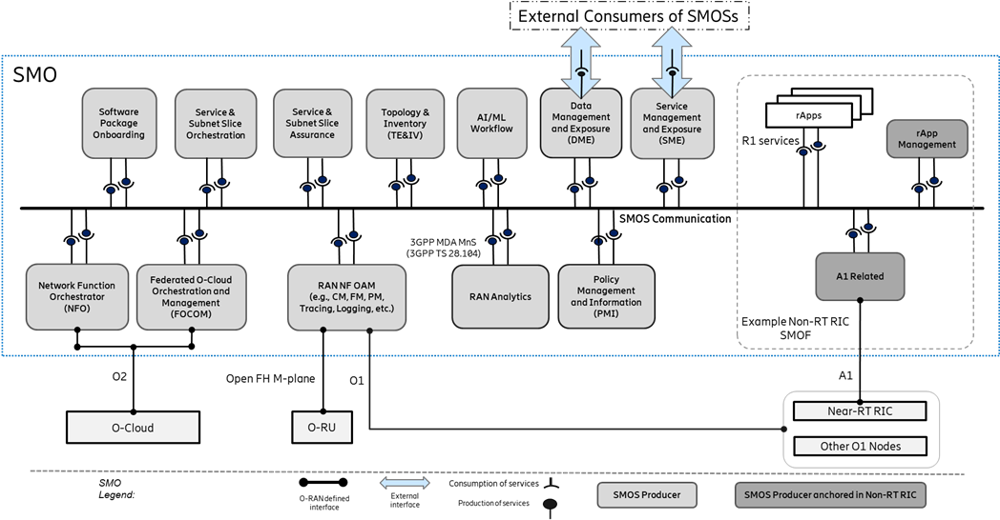

# Descrição dos elementos da arquitetura O-RAN

## Service Management and Orchestration (SMO)

O SMO é resposável pela gestão do domínio da RAN.

O princípio de concepção do SMO é em Arquitetura Baseada em Serviços (SBA).
Isso implica na definição de funções lógicas e interfaces com interoperabilidade.
Essa estrutura permite:

- Valida os serviços produzidos com casos de uso do consumidor. 
- Identificar operações de serviço com seu modelo de informação definindo o comportamento semântico. 
- Especifica a API e um modelo de dados para uma interface sintática. 
- Identifica serviços comuns que podem ser produzidos por um único produtor, como aqueles que são comumente utilizados por múltiplos consumidores internos (por exemplo, autenticação, autorização, registro e descoberta de serviços, gerenciamento de dados, etc.).

### Serviços do SMO (SMOSs)

As funções do SMO (SMOF) seguem os princípios de uma SBA e podem 
produzir e/ou consumir um ou mais serviços do SMO (SMOSs) 
se comunicando pela SMOS Communication.

O Non-RT RIC SMOF tem suporte a rApps e para serviços na interface A1

Exemplos de serviços entre os SMOS são service mesh, API gateway,

### SMO na Arquitetura O-RAN

O SMO consome serviços oferecidos por outros elementos da arquitetura O-RAN através de quatro interfaces:

- A1: interface entre Non-RT RIC e Near-RT RIC;
- O1: suporte para SMO FCAPS (Fault, Configuration, Accounting, Performance, Security)
direta ou indiretamente com as outras funções da RAN;
- O2: interface para o O-Cloud;
- Open FM M-Plane: comunicação com o O-RU no modo híbrido;

### Non-RT RIC

Funcionalidade de otimização interna da RAN.
Os serviços são implementados em rApps e tem acesso à SMOS Communication (interno) e a A1 (externo).

## Near-RT RIC

O Near-RT RIC é um NF do O-RAN que permite 
- o controle e a otimização em tempo quase real dos serviços e recursos dos Nós E2, 
- coleta de dados detalhados e ações na interface E2
- com laços de controle na ordem de 10 ms a 1 s.

O Near- RT RIC utiliza xApps para coleta e ações na interface E2.

O controle do Near-RT RIC sobre os Nós E2 é direcionado por meio das políticas e dos dados fornecidos via A1 pelo Non-RT RIC. 
Com base nos dados disponíveis, o Near-RT RIC gera as informações de análise de RAN e as expõe por meio da interface Y1.

