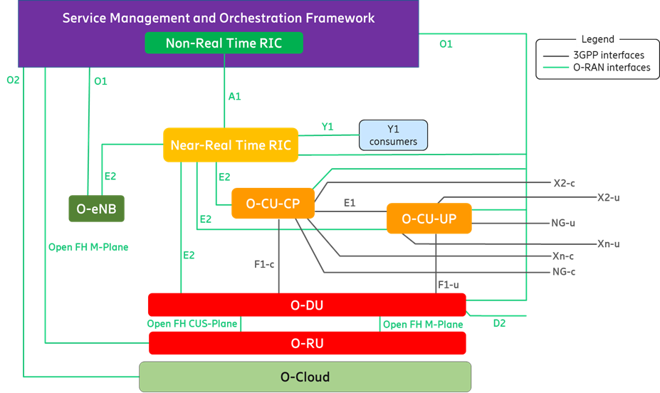
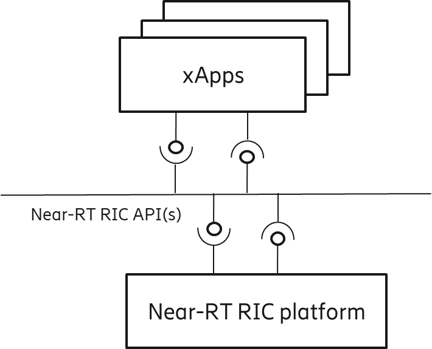

# Arquitetura do Near-RT RIC 

O objetivo desse texto é trazer um resumo explicativo de uma visão geral da arquitetura do Near-RT RIC.

Um princípio geral do Near-RT RIC é que tenha sua arquitetura e interfaces abertas para suportar xApps de terceiros.

## Near-RT RIC na Arquitetura O-RAN

O Near-RT RIC permite o controle e a otimização quase em tempo real de serviços e recursos dos Nós E2 por meio da coleta de dados detalhada e ações sobre a interface E2 com laços de controle na ordem de 10 ms a 1s. 

O controle do Near-RT RIC sobre os Nós E2 é orientado pelas políticas e pelos dados fornecidos via A1 pelo Non-RT RIC. 

Com base nos dados disponíveis, o Near-RT RIC gera as informações analíticas de RAN e as expõe através da interface Y1.

<!-- **A melhoria funcional fornecida pelo Near-RT RIC e pelo E2 Node está sujeita à capacidade do E2 Node exposta na interface E2 por meio do E2SM [25], a fim de apoiar os casos de uso descritos na Especificação Detalhada de Casos de Uso [38]. O modelo de serviço E2 descreve as funções no E2 Node que podem ser controladas pelo Near-RT RIC e os procedimentos relacionados. Para uma função exposta no E2SM [25], o Near-RT RIC pode, por exemplo, monitorar, substituir ou controlar via políticas o comportamento do E2 Node.** -->

### Near-RT RIC e xApps

O Near-RT RIC hospeda um ou mais xApps que utilizam a interface E2 para coletar informações quase em tempo real.

- O Near-RT RIC é composto por: 
  - Uma plataforma Near-RT RIC; 
  - Um ou mais xApps, conforme especificado na Arquitetura Near-RT RIC
- As funcionalidades são apresetadas como serviços. 

- Tanto a plataforma Near-RT RIC quanto um xApp podem ter serviços que geram ou consomem dados; 

- Os serviços podem ser acessados através do conjunto de APIs do Near-RT RIC.

## Requisitos da Arquitetura do Near-RT RIC

### Requisitos da Plataforma

- Requisitos Genéricos da Plataforma
  - Serviço para expor informações atualizadas da RAN, e das entidades;
  - Suporte de IA/ML;
  - Infraestrutura de mensageria;
  - Suporte O1 para gerenciamento de arquivos, rastreamento e métricas coletadas da plataforma Near-RT RIC e xApps em direção ao SMO;
  - Cumprir os requisitos de segurança do WG11 (Working group de segurança da O-RAN);
  - Mitigação de conflitos entre entre xApps na E2;
  - Mesclagem de assinaturas de múltiplos xApps;
  - Rotear mensagens de gerenciamento de política A1 para os xApps;
  - Controlar o acesso dos tipos A1-EI para xApps com base nas políticas do operador;

- Requisitos da API
  - Disponibilizar as APIs Near-RT RIC;
  - As APIs devem ser descobertas pelo xApp;

- Requistos de Gerenciamento
  - Interface O1
    - Apresentar a lista de alarmes ativos para a plataforma Near-RT RIC e xApps hospedados;
    - Relatar medições de **PM** (???) associadas a xApps individuais;
    - Gerenciar o estado administrativo de xApps individuais;
    - Ler a configuração atual dos xApps;
    - Notificar sobre qualquer mudança na configuração do xApp;
    - Notificar sobre a criação, exclusão ou modificação de um **MOI** (???) associado;
    - Notificar que há um arquivo disponível;
    - Configurar o xApp para produzir dados específicos de PM;
    - Transferência de arquivos;
- Suportar assinaturas de dados de PM para dados transmitidos de xApp;

### Requisitos dos xApp

- Relacioanda ao E2
  - Usar as APIs do Near-RT RIC para fazer uso dos Elementos de Informação (EIs) dos E2SMs;
- Genérica
  - Fornecer informações coletadas de registro, rastreamento e métricas para o Near-RT RIC;
- Relacionada a API
  - Comunicar com a Plataforma Near-RT RIC através das APIs;
  - Registrar as APIs que produz;
  - Descobrir as APIs do Near-RT RIC que consome;
- De gerenciamento
  - Ser configurável através da interface O1;
  - Apresentar opções de configuração para políticas A1 individuais quando o xApp suporta múltiplos tipos de políticas A1;

### Requisitos da API Near-RT RIC

- Gerais da API
  - As APIs Não devem impactar as operações de baixa latência. 
  - Suportar o loop de controle de 10 milissegundos a 1 segundo;
  - Ser desacopladas de soluções de implementação específicas, incluindo uma Camada de Dados Compartilhada (SDL) que funcione como uma sobreposição para bancos de dados subjacentes e permita um acesso simplificado aos dados;
  - Suportar um repositório/registro de API para os serviços da Plataforma e/ou xApps;
  - Permitir que as xApps descubram ou não as APIs publicadas com base nas necessidades das xApps e politicas configuradas;
  - Simplificar o desenvolvimento de xApps e permitir inovações rápidas;
  - Suportar xApps em várias linguagens (por exemplo, C, C++, Python, Go);
  - Gerenciamento de subscriptions de xApps com base nas políticas dos operadores. Responsável por rotear mensagens entre esta xApp e o subconjunto de nós E2;
  - Mitigação de conflitos relacionados a E2 entre xApps;

- API e Interface E2
  - Permitir que os xApps usem diretamente as informações dos E2SMs associadas;
  - As APIs relacionadas ao E2 devem expor informações de RAN acionadas por eventos e o estado da rede que varia no tempo;

- Gerenciamento
  - Configurar a xApp;
  - Alterar o estado administrativo da xApp;
  - Ler a configuração atual da xApp;
  - Permitir xApp notifique a Função de Gerenciamento (Management Function) sobre 
    - Alteração na configuração da xApp;
    - Criação, exclusão de um MOI associado;
    - Detecção de falhas;
    - Disponibiliadde de arquivos;
  - Permitir o SMO buscar a lista de Falhas Ativas no xApp;
  - Permitir a Função de Gerenciamento configurar o xApp para 
    - Enviar dados de streaming;
    - Coletar dados específicos de PM;

