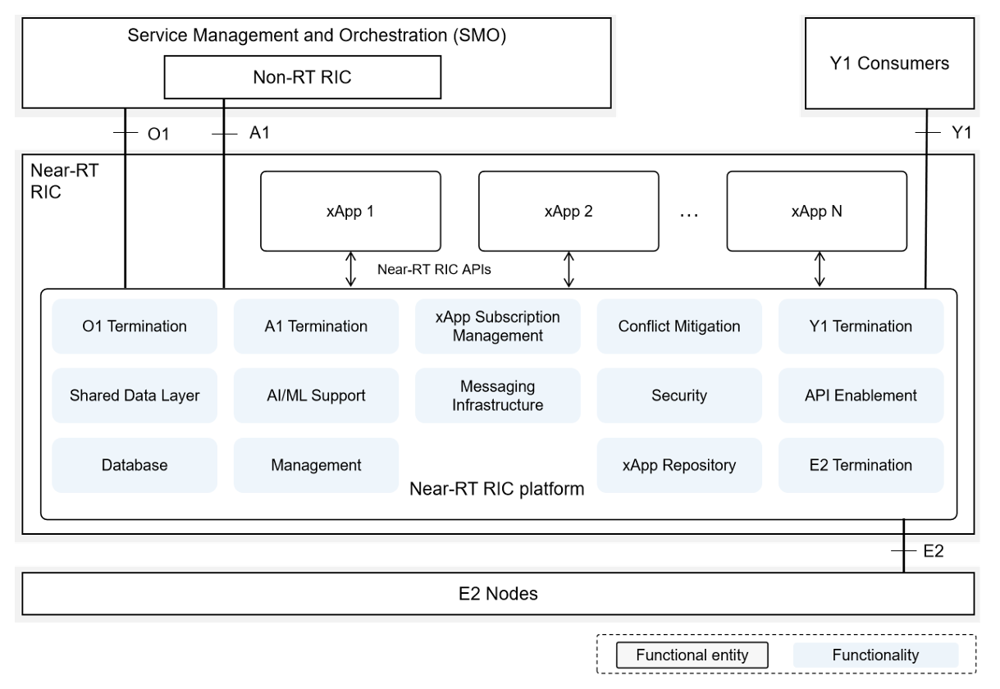

# Near-RT RIC Funcional Description

## Descrição Geral

Um Near-RT RIC é composto por uma plataforma Near-RT RIC e um ou mais xApps. Uma visão geral é mostrada na Figura acima. A Figura também mostra as funcionalidades da plataforma Near-RT RIC. Essas funcionalidades serão descritas mais detalhadamente a seguir.

## Funcionalidades da Plataforma Near-RT RIC

### Base de dados e SDL (Shared Data Layer)

As funcionalidades do banco de dados e SDL permitem que a plataforma Near-RT RIC armazene e disponibilize informações de RAN/UE e outras informações necessárias para apoiar casos de uso específicos.

#### UE-NIB

Essa funcionalidade permite que a plataforma Near-RT RIC mantenha informações relacionadas ao UE: 
  - Manutenção de uma lista de UEs e dados associados; 
  - rastreamento e correlação das identidades dos UEs associadas aos Nós E2 conectados. 
  
Essas informações podem ser geradas e acessadas pela plataforma Near-RT RIC ou por xApps autorizados.